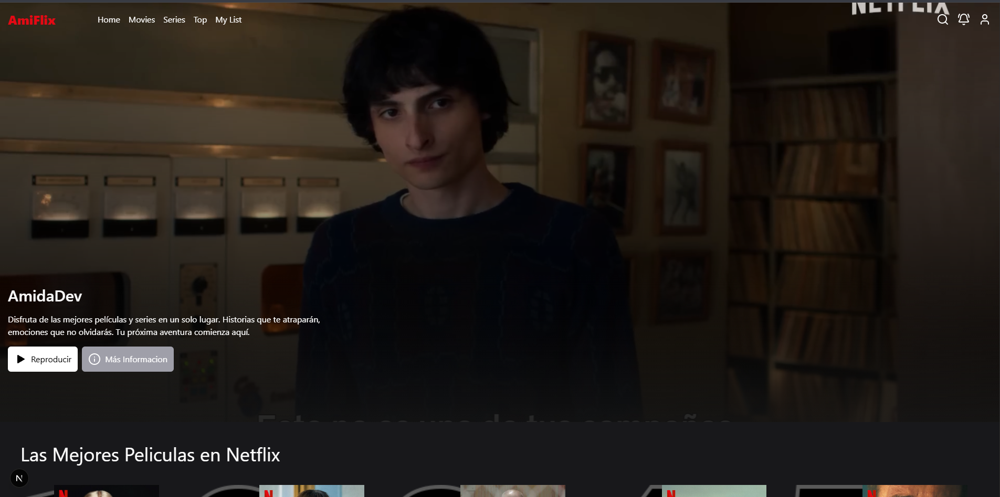
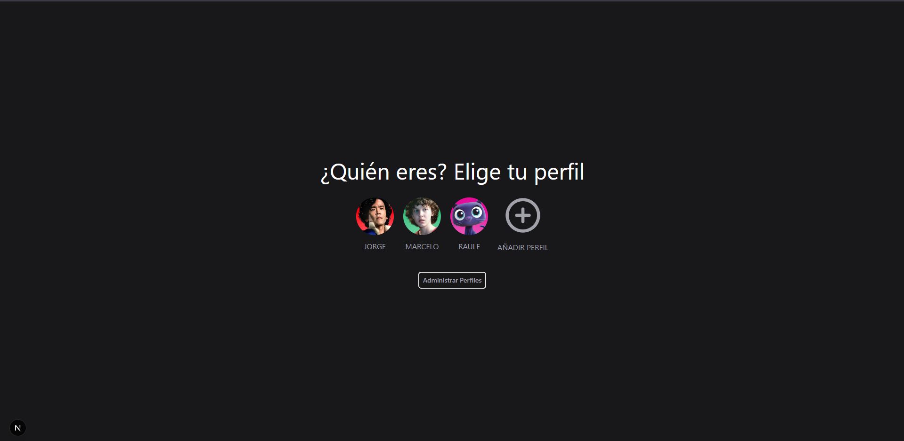
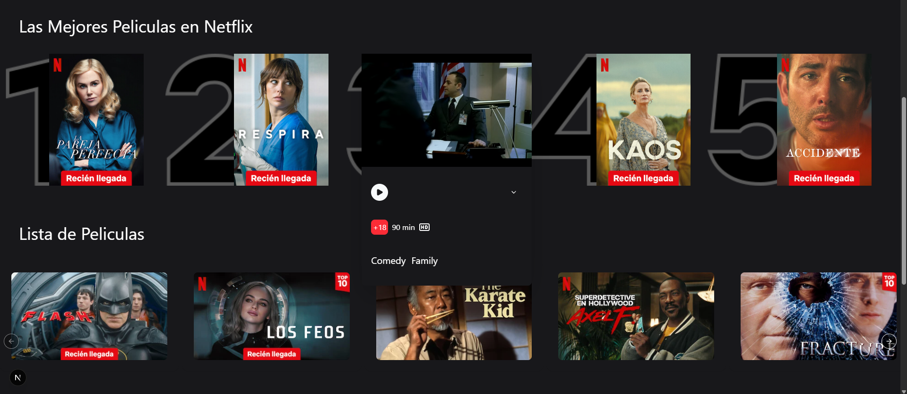
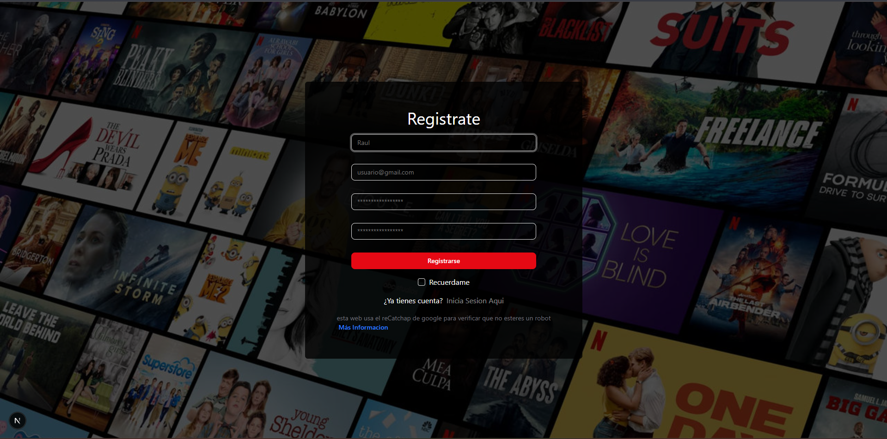
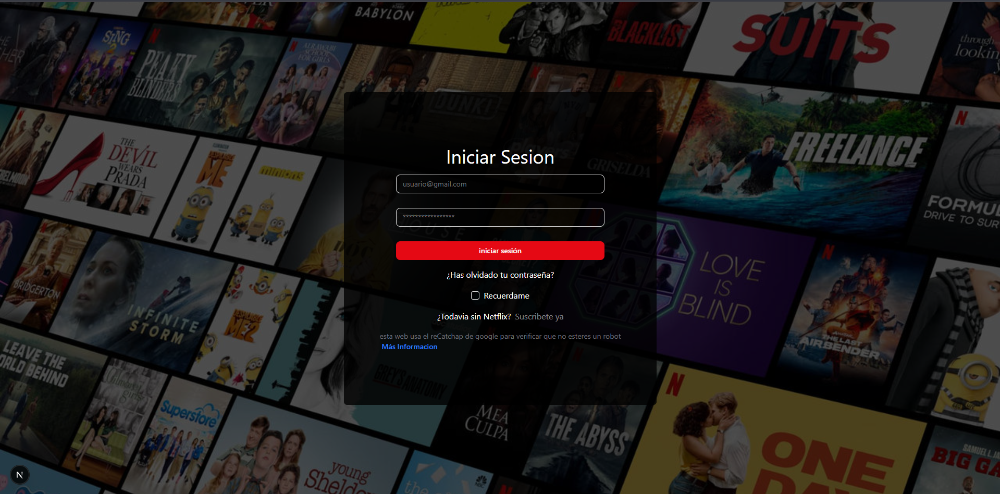

# 🎬 Netflix Clone

A modern Netflix clone built with **React, Next.js, and Tailwind CSS**, featuring authentication, user profiles, and a dynamic movie browsing experience.

---

## 🚀 Features

* 🔐 User authentication (Login & Register)
* 👤 Multiple user profiles selection
* 🎥 Browse movies (including popular movies)
* ❤️ Add movies to favorites
* 📱 Fully responsive design (mobile, tablet, desktop)
* ⚡ Fast and optimized with Next.js

---

## 🛠️ Tech Stack

* **Frontend:** React, Next.js
* **Styling:** Tailwind CSS
* **Backend:** Next.js API Routes
* **Database:** Prisma ORM
* **HTTP Client:** Axios

---

## 📸 Screenshots








---

## ⚙️ Installation

Clone the repository:

```bash
git clone https://github.com/your-username/netflix-clone.git
cd netflix-clone
```

Install dependencies:

```bash
npm install
```

Run the development server:

```bash
npm run dev
```

Open in browser:

```
http://localhost:3000
```

---

## 📂 Project Structure

```
/app
/components
/lib
/prisma
/public
```

---

## 🔑 Environment Variables

Create a `.env` file and add:

```
DATABASE_URL=your_database_url
NEXTAUTH_SECRET=your_secret
```

---

## 🧠 Future Improvements

* 🎬 Video streaming player
* 🔍 Search functionality
* ⭐ Ratings and reviews
* 📊 Recommendations system

---

## 📄 License

This project is for educational purposes.

---

## ✨ Author

Developed by Jorge Teves
